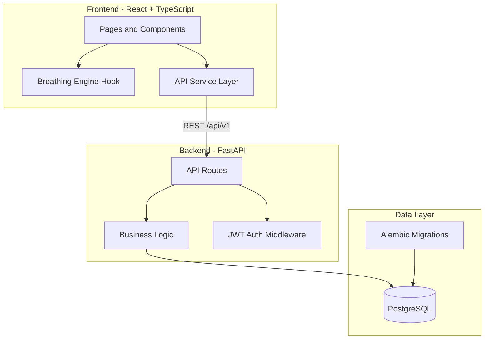

# BreathePulse

A full-stack wellness application for guided breathing exercises with HRV tracking, session analytics, and pulse calibration. Built to demonstrate production-grade engineering practices for portfolio and interview contexts.

**Live Demo:** _Deploy to Vercel + Fly.io and add your URL here_

## Features

- **Guided Breathing Engine** — Box, 4-7-8, and Wim Hof patterns with animated visual ring, Web Audio API cues, and session state machine
- **Session Tracking** — Persist completed sessions with duration, cycles, heart rate, and HRV data
- **Analytics Dashboard** — Weekly activity charts, pattern breakdown, session heatmap, streaks, and consistency score
- **Pulse Calibration** — Webcam-based rPPG calibration with simulated fallback
- **User Profiles** — Display name, daily goals, and preferred breathing pattern
- **Auth** — Supabase JWT in production; dev mode for local development without credentials

## Architecture



## Tech Stack

| Layer | Technologies |
|-------|-------------|
| Frontend | React 18, TypeScript (strict), Vite, Tailwind CSS, Radix UI, TanStack Query, Zustand, Recharts |
| Backend | FastAPI, Pydantic v2, SQLAlchemy 2.0 (async), Alembic, structlog, slowapi |
| Database | PostgreSQL 16 |
| Auth | Supabase Auth (JWT) with dev-mode fallback |
| Testing | pytest, Vitest, Playwright |
| CI/CD | GitHub Actions |
| DevOps | Docker Compose, Makefile |

## Quick Start

### Prerequisites

- Node.js 20+
- Python 3.11+
- [uv](https://docs.astral.sh/uv/) package manager
- Docker (for PostgreSQL)

### 1. Clone and configure

```bash
git clone https://github.com/ARasugit20/BreathePulse.git
cd BreathePulse
cp .env.example .env
```

### 2. Start PostgreSQL

```bash
make docker-up
```

### 3. Install dependencies

```bash
make install
```

### 4. Run database migrations

```bash
make migrate
```

### 5. Start servers (separate terminals)

```bash
make run-backend   # http://localhost:8000
make run-frontend  # http://localhost:5173
```

Visit [http://localhost:5173](http://localhost:5173) to use the app. In dev mode, auth is automatic — no Supabase setup required.

## API Endpoints

| Method | Endpoint | Description |
|--------|----------|-------------|
| GET | `/health` | Health check |
| GET | `/api/v1/users/me` | Get user profile |
| PATCH | `/api/v1/users/me` | Update profile |
| GET | `/api/v1/sessions/patterns` | List breathing patterns |
| GET | `/api/v1/sessions` | List user sessions |
| POST | `/api/v1/sessions` | Create session |
| DELETE | `/api/v1/sessions/{id}` | Delete session |
| GET | `/api/v1/analytics/summary` | Analytics dashboard data |

Interactive docs: [http://localhost:8000/docs](http://localhost:8000/docs)

## Testing

```bash
# Backend (pytest)
make test-backend

# Frontend (Vitest)
make test-frontend

# E2E (Playwright — requires frontend dev server)
cd frontend && yarn test:e2e

# All
make test
```

## Project Structure

```
BreathePulse/
├── backend/
│   ├── app/
│   │   ├── apis/          # FastAPI route handlers
│   │   ├── core/          # Config, auth, logging
│   │   ├── db/            # SQLAlchemy models
│   │   ├── models/        # Pydantic schemas
│   │   └── services/      # Business logic
│   ├── alembic/           # Database migrations
│   └── tests/             # pytest suite
├── frontend/
│   ├── src/
│   │   ├── components/    # UI components
│   │   ├── hooks/           # Breathing engine hook
│   │   ├── pages/           # Route pages
│   │   ├── services/        # API client
│   │   ├── stores/          # Zustand state
│   │   ├── types/           # TypeScript types
│   │   └── utils/           # Breathing logic
│   └── e2e/                 # Playwright tests
├── .github/workflows/       # CI pipeline
├── docker-compose.yml
└── Makefile
```

## Design Decisions

- **Monorepo with `frontend/` + `backend/`** — Clear separation, independent deployability, matches how real teams structure full-stack projects
- **Supabase Auth over custom auth** — Industry-standard JWT flow without reinventing password hashing; dev mode bypasses it for zero-config local dev
- **SQLAlchemy async + Alembic** — Demonstrates database craft (migrations, ORM, async I/O) that interviewers look for
- **Trimmed dependencies (~25 frontend packages)** — Intentional dependency hygiene vs. the 270+ package Databutton boilerplate
- **Breathing engine as a custom hook** — Shows React patterns (state machines, refs, effects) without relying on a library for core domain logic

## Deployment

- **Frontend:** Vercel or Netlify (`frontend/` directory, build command: `yarn build`)
- **Backend:** Fly.io or Railway (`backend/` directory, Dockerfile included)
- **Database:** Managed PostgreSQL (Supabase, Neon, or Railway)

Set environment variables from `.env.example` in your deployment platform.

## License

MIT
